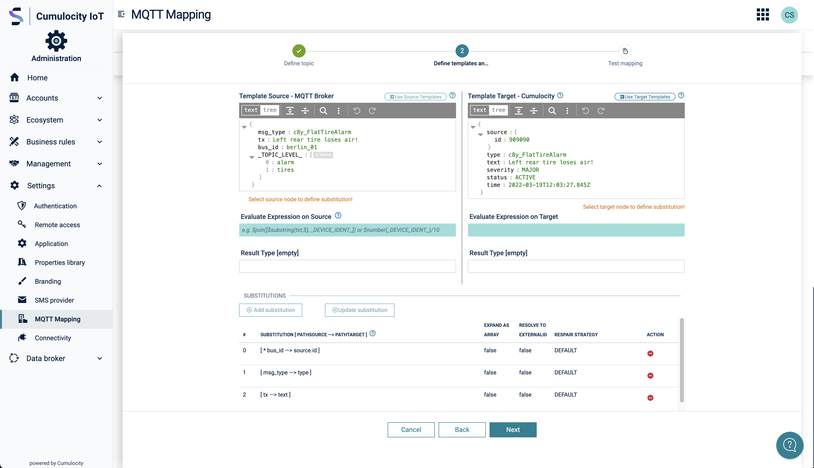

# Overview

**PLEASE REMOVE THIS PART BELOW FROM YOUR README.md**

--- 

This template repo should be u sed for all iot related open-source repositories.
It contains basic guidelines in regards of:

- Naming the Repo
- FOSS Licensing
- Topics
- README.md structure
- GitHub Setting

Please check out the [full repo guide](./REPO_GUIDE.md) for more details

--- 

**PLEASE REMOVE THIS PART ABOVE FROM YOUR README.md**

# Overview

This repository contains an awesome component for Cumulocity!!

Check out the cool picture of an architecture / screenshot of the component ;-)



# Installation

To install the component just download the latest zip from here and upload it to Cumulocity.

# Run

In Cumulocity navigate to Adminstration --> Settings --> My Component to see the new UI.

# Build

To build the component please use the following comand
```
c8ycli build
```

# Release Notes

Check out the latest release notes...

# Licensing

Copyright 2025-present Cumulocity GmbH

This project is licensed under the Apache 2.0 license - see https://www.apache.org/licenses/LICENSE-2.0

# Contribution Guidelines

If you want to contribute please follow the below described process:


--- 

These tools are provided as-is and without warranty or support. They do not constitute part of the product suite. Users are free to use, fork and modify them, subject to the license agreement. While we welcome contributions, we cannot guarantee to include every contribution in the main project.

For more information you can Ask a Question in the [Cumulocity Tech Community](https://techcommunity.cumulocity.com/). Contact us there if you have any questions.
